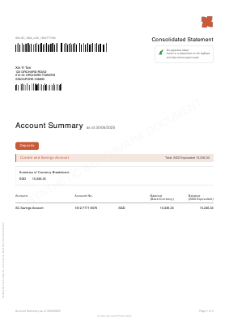
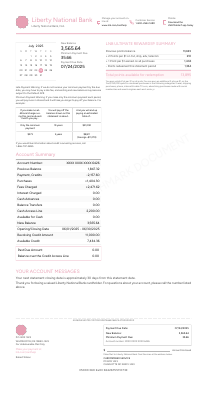
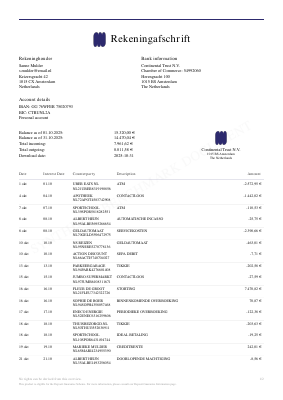

# Bank Statement Parsing Benchmark (BSPB)

<!-- SUBTITLE_START -->
A standardized benchmark for evaluating bank statement PDF parsers. 15 synthetic statements across 3 difficulty tiers, 12 countries, 8 languages, and 40 parsing challenges.
<!-- SUBTITLE_END -->

**[Browse the dataset](https://bankstatemently.com/benchmark)** | **[Challenge browser](https://bankstatemently.com/benchmark/challenges)** | **[API docs](https://bankstatemently.com/developers/api)**

## Why this exists

There is no standard way to measure how well a bank statement parser works. Every tool claims high accuracy, but there's no shared dataset to verify against. BSPB provides:

- **Synthetic statements** that are safe to distribute (no real customer data)
- **Known ground truth** held server-side for tamper-proof scoring
- **Real-world challenges** — bilingual headers, Buddhist era dates, scanned PDFs, multi-currency, 9-column layouts, and many more
- **Automated evaluation** via API — submit your parsed output, get a score

## Sample statements

<p align="center">
  
  &nbsp;&nbsp;&nbsp;
  
  &nbsp;&nbsp;&nbsp;
  
</p>
<p align="center">
  <em>bsb-001 (Singapore) &nbsp;·&nbsp; bsb-002 (US credit card) &nbsp;·&nbsp; bsb-003 (Netherlands)</em>
</p>

All statements use fictional banks with synthetic data. No real customer information.

## Dataset

### Structure

```
datasets/
  basic/
    bsb-001/
      bsb-001-statement.pdf    # The statement to parse
      statement-info.json      # Metadata (challenges, country, currency)
    bsb-002/
    ...
  intermediate/
    bsb-006/
    ...
  advanced/
    bsb-011/
    ...
manifest.json                  # Dataset version, checksums, challenge index
```

### Statements

<!-- STATEMENTS_TABLE_START -->
| | ID | Difficulty | Country | Lang | Type | Pages | Txns | Challenges | |
|---|---|---|---|---|---|--:|--:|------------|---|
|  | bsb-001 |  | 🇸🇬 SG | EN | Bank | 3 | 12 | Credit/debit columns, Balance validation, Multi-line descriptions |  |
|  | bsb-002 |  | 🇺🇸 US | EN | Credit Card | 4 | 15 | Inverted CC sign convention, Posting dates, Transaction continuation, Non-standard page size, Partial-year dates |  |
|  | bsb-003 |  | 🇳🇱 NL | NL | Bank | 3 | 22 | Posting dates, Counterparty column, Balance validation, Currency symbols, Partial-year dates |  |
|  | bsb-004 |  | 🇭🇰 HK | EN | Bank | 4 | 25 | Credit/debit columns, Multi-line descriptions, Balance validation, Posting dates, Multiple accounts |  |
|  | bsb-005 |  | 🇨🇦 CA | FR | Bank | 2 | 25 | Embedded date column, Credit/debit columns, Two-digit year dates, Date format variations, Balance validation |  |
|  | bsb-006 |  | 🇲🇽 MX | ES | Bank | 1 | 30 | Credit/debit columns, Dual balance timeline, Partial-year dates, Balance validation | *Coming soon* |
|  | bsb-007 |  | 🇨🇦 CA | FR/EN | Credit Card | 1 | 25 | Posting dates, Split date columns, Multiple tables | *Coming soon* |
|  | bsb-008 |  | 🇦🇺 AU | EN | Bank | 1 | 30 | Date-time columns, Date format variations, Scanned PDF, Credit/debit columns, Balance validation | *Coming soon* |
|  | bsb-009 |  | 🇬🇧 GB | EN | Bank | 1 | 35 | Credit/debit columns, Posting dates, Balance validation, Date format variations, Currency symbols, No table boundaries | *Coming soon* |
|  | bsb-010 |  | 🇮🇳 IN | EN | Bank | 25 | 500 | Credit/debit columns, Balance validation, Payment method column, Date format variations, Balance carry-forward, Date carry-forward | *Coming soon* |
|  | bsb-011 |  | 🇭🇰 HK | EN/ZH | Bank | 2 | 35 | Bilingual headers, Mixed-locale formatting, Credit/debit columns, Multi-currency, Multiple accounts, End-of-day balance | *Coming soon* |
|  | bsb-012 |  | 🇸🇬 SG | ZH | Credit Card | 1 | 33 | Inverted CC sign convention, Fee/interest sections, Zero-value rows, Partial-year dates, Scanned PDF, Header/footer noise | *Coming soon* |
|  | bsb-013 |  | 🇰🇿 KZ | EN | Bank | 2 | 35 | Multi-currency, Dual-currency display, Credit/debit columns, Fee column, Multiple accounts | *Coming soon* |
|  | bsb-014 |  | 🇹🇭 TH | TH/EN | Bank | 1 | 28 | Buddhist era dates, Bilingual headers, Credit/debit columns, Payment method column, Balance validation | *Coming soon* |
|  | bsb-015 |  | 🇲🇾 MY | EN/MS | Credit Card | 1 | 20 | Bilingual headers, Mixed-locale formatting, Posting dates, Header-only currency symbol, Multiple tables, Scanned PDF, Trailing sign amounts | *Coming soon* |
<!-- STATEMENTS_TABLE_END -->

### Fictional banks

The benchmark uses 6 fictional banks, each with their own visual identity and statement design:

<!-- BANKS_TABLE_START -->
| | Bank | Statements |
|---|------|------------|
|  | **Continental Trust** | bsb-003, bsb-007 |
|  | **Harbour Bank** | bsb-005, bsb-009 |
|  | **Liberty National Bank** | bsb-002, bsb-006 |
|  | **Silk Road Banking** | bsb-004, bsb-013, bsb-014 |
|  | **Southern Cross Financial** | bsb-008, bsb-011, bsb-015 |
|  | **Straits Capital** | bsb-001, bsb-010, bsb-012 |
<!-- BANKS_TABLE_END -->

### Challenges

Each statement exercises specific parsing challenges found in real-world bank statements. The full list of 40 challenges:

<!-- CHALLENGES_TABLE_START -->
| Challenge | Description | Statements |
|-----------|-------------|:--:|
| `balance-carry-forward-rows` | Phantom Balance Rows on Every Page | 1 |
| `balance-validation` | Running Balance Cross-Check | 9 |
| `bilingual-descriptions` | Bilingual Transaction Descriptions | 0 |
| `bilingual-headers` | Bilingual Column Headers | 3 |
| `buddhist-era-dates` | Buddhist Era Calendar (Year +543) | 1 |
| `credit-debit-columns` | Separate Credit & Debit Columns | 10 |
| `currency-symbol-amounts` | Currency Symbols Breaking Numeric Parsing | 2 |
| `currency-symbol-header-only` | Currency Only Shown in Column Header | 1 |
| `date-carry-forward` | Blank Dates for Same-Day Transactions | 1 |
| `date-format-variations` | Inconsistent Date Formats | 4 |
| `date-time-dual-column` | Column Mixes Times and Dates | 1 |
| `date-with-time` | Times Mixed Into Date Column | 0 |
| `debit-credit-appearance` | Misleading Debit/Credit Signs | 0 |
| `dual-balance-timeline` | Dual Balance Timeline | 1 |
| `dual-currency-display` | Two Currencies Shown Side-by-Side | 1 |
| `end-of-day-balance` | Sparse Balance Column (End-of-Day Only) | 1 |
| `fee-and-interest-sections` | Fees & Interest Buried in Separate Sections | 1 |
| `fee-column` | Fees in a Separate Column | 1 |
| `header-footer-noise` | Page Headers & Footers Mixed with Data | 1 |
| `inverted-cc-sign-convention` | Charges Shown as Negative (Inverted Signs) | 2 |
| `mixed-locale-formatting` | Mixed Locale Formatting | 2 |
| `multi-currency` | Multiple Currencies in One Table | 2 |
| `multi-line-descriptions` | Multi-Line Text Within a Cell | 2 |
| `multiple-accounts-multiple-tables` | Separate Transaction Tables per Account | 1 |
| `multiple-accounts-single-table` | Multiple Accounts Mixed in One Table | 2 |
| `multiple-tables` | Transactions Split Across Multiple Tables | 2 |
| `no-table-boundaries` | No Visible Table Lines or Borders | 1 |
| `non-standard-page-size` | Non-Standard Page Size | 1 |
| `partial-year-dates` | Missing Year in Dates | 4 |
| `payment-method-column` | Payment Method/Rails Information | 2 |
| `posting-date-selection` | Multiple Dates per Transaction | 6 |
| `reverse-chronological-order` | Transactions Listed Newest-First | 0 |
| `scanned-pdf-text` | No Selectable Text (Scanned PDF) | 3 |
| `separate-counterparty-column` | Separate Counterparty Column | 1 |
| `split-date-columns-merged` | Date Split Across Day/Month Columns | 1 |
| `split-embedded-date-column` | Date Hidden Inside Description Text | 1 |
| `trailing-sign-amounts` | Plus/Minus Sign After the Amount | 1 |
| `transaction-continuation` | Description Continuation Rows | 1 |
| `two-digit-year-dates` | Abbreviated Year in Dates | 1 |
| `zero-value-informational-rows` | Zero-Value Fee & Interest Lines | 1 |
<!-- CHALLENGES_TABLE_END -->

Explore interactive examples at [bankstatemently.com/benchmark/challenges](https://bankstatemently.com/benchmark/challenges).

## Evaluation

The dataset is fully open — use it however you like. If you want to score your parser against ground truth without building your own evaluation pipeline, Bankstatemently provides a free evaluation API.

### Quick start

1. Get a free API key at [bankstatemently.com/developers](https://bankstatemently.com/developers)
2. Parse any statement PDF with your tool
3. Format the output as JSON (see schema below)
4. Submit to the evaluation endpoint with the PDF's SHA-256 hash

```bash
HASH=$(shasum -a 256 bsb-001-statement.pdf | cut -d' ' -f1)

curl -X POST https://api.bankstatemently.com/v1/benchmark/evaluate \
  -H "Content-Type: application/json" \
  -H "X-API-Key: bsk_live_..." \
  -d "{
    \"contentHash\": \"$HASH\",
    \"transactions\": [
      {
        \"date\": \"2025-06-02\",
        \"description\": \"NTUC FAIRPRICE\",
        \"amount\": 12.20,
        \"direction\": \"debit\",
        \"balance\": 15438.55,
        \"originalData\": {
          \"Date\": \"02/06/2025\",
          \"Description\": \"NTUC FAIRPRICE\",
          \"Withdrawal (-)\": \"12.20\",
          \"Balance\": \"15,438.55\"
        }
      }
    ]
  }"
```

### Response

```json
{
  "contentHash": "9772253f...",
  "id": "bsb-001",
  "datasetVersion": "2.0",
  "difficulty": "basic",
  "challenges": ["credit-debit-columns", "balance-validation", "multi-line-descriptions"],
  "parsedScore": {
    "overall": 0.945,
    "extraction": 0.972,
    "integrity": 0.973,
    "fields": {
      "date": 0.99,
      "description": 0.95,
      "amount": 0.97,
      "balance": 0.97
    },
    "alignment": { "matched": 12, "missing": 0, "extra": 0, "total": 12 }
  },
  "normalizedScore": {
    "overall": 0.941,
    "extraction": 0.965,
    "integrity": 0.973,
    "fields": { "date": 0.98, "description": 0.91, "amount": 0.95, "balance": 0.93 },
    "alignment": { "matched": 12, "missing": 0, "extra": 0, "total": 12 }
  }
}
```

### Two scores

The API evaluates two dimensions of parser quality, each returning `extraction`, `integrity`, per-field accuracy, and row-level alignment:

- **Parsed score**: How accurately did you extract raw cell values from the PDF? Compared against the original text as it appears in the document (e.g., `"02/06/2025"`, `"15,438.55"`).
- **Normalized score**: How well did you convert extracted values to canonical form? Compared against ISO dates, numeric amounts, and unified debit/credit direction.

`overall` = `extraction` × `integrity`. Both scores require `originalData` on each transaction — the raw column values as they appear in the PDF.

### Rate limits

50 requests/hour per API key. No credits consumed — benchmark evaluation is free.

Get a free API key at [bankstatemently.com/developers](https://bankstatemently.com/developers).

## Submission schema

```typescript
interface Submission {
  contentHash: string;         // SHA-256 hex digest of the PDF (64 chars)
  transactions: Transaction[];
}

interface Transaction {
  date: string;                // ISO 8601 preferred (e.g. "2025-06-02")
  description: string;
  amount: number;              // Positive value; use direction for sign
  direction?: "credit" | "debit"; // If omitted, inferred from amount sign (negative = debit)
  balance?: number;            // Running balance if available
  currency?: string;           // ISO currency code (for multi-currency statements)
  originalData: Record<string, string>; // Raw cell values as they appear in the PDF (required)
}
```

## Example submission

See [`examples/bsb-001-submission.json`](examples/bsb-001-submission.json) for a complete submission with all 12 transactions, including `originalData` for each row.

## Dataset integrity

Each PDF has a SHA-256 checksum in `manifest.json`. Use the included script to compute hashes:

```bash
# Hash a single PDF (this is the contentHash for the evaluation API)
./scripts/hash.sh datasets/basic/bsb-001/bsb-001-statement.pdf

# Verify all PDFs
for dir in datasets/*/*; do
  id=$(basename "$dir")
  echo "$id: $(./scripts/hash.sh "$dir/$id-statement.pdf")"
done
```

## License

MIT. See [LICENSE](LICENSE).

---

Built by [Bankstatemently](https://bankstatemently.com) — convert bank statement PDFs to Excel, CSV, QBO, and Xero.
