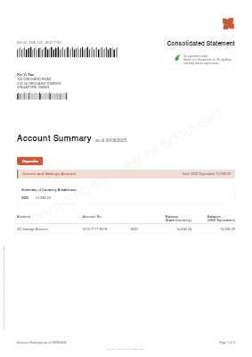
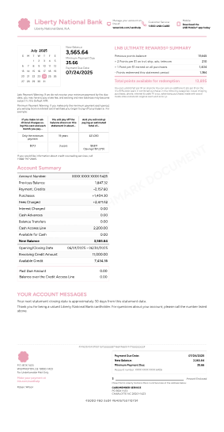
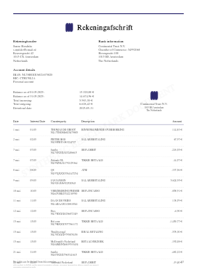
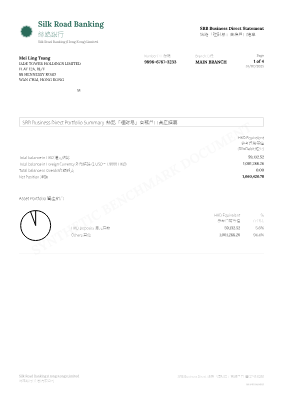
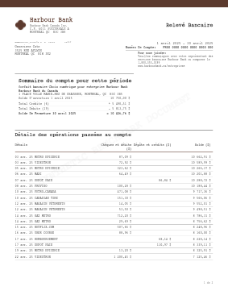

# Bankstatemently Open Benchmark

<!-- SUBTITLE_START -->
A standardized benchmark for evaluating bank and credit card statement PDF parsers. 15 synthetic statements across 3 difficulty tiers, 12 countries, 8 languages, and 41 parsing challenges.
<!-- SUBTITLE_END -->

**[Browse the dataset](https://bankstatemently.com/benchmark)** | **[Challenge browser](https://bankstatemently.com/benchmark/challenges)** | **[API docs](https://bankstatemently.com/developers/api)** | **[Also on Hugging Face](https://huggingface.co/datasets/Bankstatemently/bank-statement-parsing-benchmark)**

## Why this exists

There is no standard way to measure how well a bank statement parser works. Every tool claims high accuracy, but there's no shared dataset to verify against. The Bankstatemently Open Benchmark provides:

- **Synthetic bank and credit card statements** that are safe to distribute (no real customer data)
- **Known ground truth** held server-side for tamper-proof scoring
- **Real-world challenges** — bilingual headers, Buddhist era dates, scanned PDFs, multi-currency, 9-column layouts, and many more
- **Automated evaluation** via API — submit your parsed output, get a score

## Sample statements

<p align="center">
  
  &nbsp;&nbsp;
  
  &nbsp;&nbsp;
  
  &nbsp;&nbsp;
  
  &nbsp;&nbsp;
  
</p>
<p align="center">
  <em> bsb-001 (Singapore) &nbsp;·&nbsp;  bsb-002 (US credit card) &nbsp;·&nbsp;  bsb-003 (Netherlands) &nbsp;·&nbsp;  bsb-004 (Hong Kong) &nbsp;·&nbsp;  bsb-005 (Canada, French)</em>
</p>

All statements use fictional banks with synthetic data. No real customer information.

## Dataset

### Structure

```
datasets/
  basic/
    bsb-001/
      bsb-001-statement.pdf    # The statement to parse
      statement-info.json      # Metadata (challenges, country, currency)
    bsb-002/
    ...
  intermediate/
    bsb-006/
    ...
  advanced/
    bsb-011/
    ...
manifest.json                  # Dataset version, checksums, challenge index
```

### Statements

<!-- STATEMENTS_TABLE_START -->
| ID | Difficulty | Country | Lang | Type | Pages | Txns | Challenges | |
|---|---|---|---|---|--:|--:|------------|---|
| bsb-001 |  | 🇸🇬 SG | EN | Bank | 3 | 12 | Separate Credit & Debit Columns, Running Balance Cross-Check, Multi-Line Text Within a Cell | ✓ |
| bsb-002 |  | 🇺🇸 US | EN | Credit Card | 4 | 15 | Charges Shown as Negative, Multiple Dates per Transaction, Description Continuation Rows, Non-Standard Page Size, Missing Year in Dates | ✓ |
| bsb-003 |  | 🇳🇱 NL | NL/EN | Bank | 3 | 22 | Multiple Dates per Transaction, Separate Counterparty Column, Running Balance Cross-Check, Currency Symbols Breaking Numeric Parsing, Missing Year in Dates | ✓ |
| bsb-004 |  | 🇭🇰 HK | EN | Bank | 4 | 25 | Separate Credit & Debit Columns, Multi-Line Text Within a Cell, Running Balance Cross-Check, Separate Transaction Tables per Account | ✓ |
| bsb-005 |  | 🇨🇦 CA | FR | Bank | 2 | 25 | Date Hidden Inside Description Text, Separate Credit & Debit Columns, Abbreviated Year in Dates, Inconsistent Date Formats, Running Balance Cross-Check | ✓ |
| bsb-006 |  | 🇲🇽 MX | ES | Bank | 1 | 30 | Separate Credit & Debit Columns, Dual Balance Timeline, Missing Year in Dates, Running Balance Cross-Check | *Coming soon* |
| bsb-007 |  | 🇨🇦 CA | FR/EN | Credit Card | 1 | 25 | Multiple Dates per Transaction, Date Split Across Day/Month Columns, Transactions Split Across Multiple Tables | *Coming soon* |
| bsb-008 |  | 🇦🇺 AU | EN | Bank | 1 | 30 | Column Mixes Times and Dates, Inconsistent Date Formats, No Selectable Text (Scanned PDF), Separate Credit & Debit Columns, Running Balance Cross-Check | *Coming soon* |
| bsb-009 |  | 🇬🇧 GB | EN | Bank | 1 | 35 | Separate Credit & Debit Columns, Multiple Dates per Transaction, Running Balance Cross-Check, Inconsistent Date Formats, Currency Symbols Breaking Numeric Parsing, No Visible Table Lines or Borders | *Coming soon* |
| bsb-010 |  | 🇮🇳 IN | EN | Bank | 25 | 500 | Separate Credit & Debit Columns, Running Balance Cross-Check, Payment Method/Rails Information, Inconsistent Date Formats, Phantom Balance Rows on Every Page, Blank Dates for Same-Day Transactions | *Coming soon* |
| bsb-011 |  | 🇭🇰 HK | EN/ZH | Bank | 2 | 35 | Bilingual Column Headers, Mixed Number Formats, Separate Credit & Debit Columns, Multiple Currencies in One Table, Multiple Accounts Mixed in One Table, Sparse Balance Column (End-of-Day Only) | *Coming soon* |
| bsb-012 |  | 🇸🇬 SG | ZH | Credit Card | 1 | 31 | Charges Shown as Negative, Fees & Interest Buried in Separate Sections, Zero-Value Fee & Interest Lines, Missing Year in Dates, No Selectable Text (Scanned PDF), Page Headers & Footers Mixed with Data | *Coming soon* |
| bsb-013 |  | 🇰🇿 KZ | EN | Bank | 2 | 35 | Multiple Currencies in One Table, Two Currencies Shown Side-by-Side, Separate Credit & Debit Columns, Fees in a Separate Column, Multiple Accounts Mixed in One Table | *Coming soon* |
| bsb-014 |  | 🇹🇭 TH | TH/EN | Bank | 1 | 28 | Buddhist Era Calendar (Year +543), Bilingual Column Headers, Separate Credit & Debit Columns, Payment Method/Rails Information, Running Balance Cross-Check | *Coming soon* |
| bsb-015 |  | 🇲🇾 MY | EN/MS | Credit Card | 1 | 20 | Bilingual Column Headers, Mixed Number Formats, Multiple Dates per Transaction, Currency Only Shown in Column Header, Transactions Split Across Multiple Tables, No Selectable Text (Scanned PDF), Plus/Minus Sign After the Amount | *Coming soon* |
<!-- STATEMENTS_TABLE_END -->

### Fictional banks

The benchmark uses 6 fictional banks, each with their own visual identity and statement design:

<!-- BANKS_TABLE_START -->
| | Bank | Statements |
|---|------|------------|
|  | **Continental Trust** | bsb-003, bsb-007 |
|  | **Harbour Bank** | bsb-005, bsb-009 |
|  | **Liberty National Bank** | bsb-002, bsb-006 |
|  | **Silk Road Banking** | bsb-004, bsb-013, bsb-014 |
|  | **Southern Cross Financial** | bsb-008, bsb-011, bsb-015 |
|  | **Straits Capital** | bsb-001, bsb-010, bsb-012 |
<!-- BANKS_TABLE_END -->

### Challenges

Each statement exercises specific parsing challenges found in real-world bank statements. The full list of 40 challenges:

<!-- CHALLENGES_TABLE_START -->
| Challenge | Description | Statements |
|-----------|-------------|:--:|
| [`balance-carry-forward-rows`](https://bankstatemently.com/benchmark/challenges#balance-carry-forward-rows) | Phantom Balance Rows on Every Page | 0 / 1 |
| [`balance-validation`](https://bankstatemently.com/benchmark/challenges#balance-validation) | Running Balance Cross-Check | 4 / 9 |
| [`bilingual-headers`](https://bankstatemently.com/benchmark/challenges#bilingual-headers) | Bilingual Column Headers | 0 / 3 |
| [`buddhist-era-dates`](https://bankstatemently.com/benchmark/challenges#buddhist-era-dates) | Buddhist Era Calendar (Year +543) | 0 / 1 |
| [`charges-shown-as-negative`](https://bankstatemently.com/benchmark/challenges#charges-shown-as-negative) | Charges Shown as Negative | 1 / 2 |
| [`credit-debit-columns`](https://bankstatemently.com/benchmark/challenges#credit-debit-columns) | Separate Credit & Debit Columns | 3 / 10 |
| [`currency-symbol-amounts`](https://bankstatemently.com/benchmark/challenges#currency-symbol-amounts) | Currency Symbols Breaking Numeric Parsing | 1 / 2 |
| [`currency-symbol-header-only`](https://bankstatemently.com/benchmark/challenges#currency-symbol-header-only) | Currency Only Shown in Column Header | 0 / 1 |
| [`date-carry-forward`](https://bankstatemently.com/benchmark/challenges#date-carry-forward) | Blank Dates for Same-Day Transactions | 0 / 1 |
| [`date-format-variations`](https://bankstatemently.com/benchmark/challenges#date-format-variations) | Inconsistent Date Formats | 1 / 4 |
| [`date-time-dual-column`](https://bankstatemently.com/benchmark/challenges#date-time-dual-column) | Column Mixes Times and Dates | 0 / 1 |
| [`dual-balance-timeline`](https://bankstatemently.com/benchmark/challenges#dual-balance-timeline) | Dual Balance Timeline | 0 / 1 |
| [`dual-currency-display`](https://bankstatemently.com/benchmark/challenges#dual-currency-display) | Two Currencies Shown Side-by-Side | 0 / 1 |
| [`end-of-day-balance`](https://bankstatemently.com/benchmark/challenges#end-of-day-balance) | Sparse Balance Column (End-of-Day Only) | 0 / 1 |
| [`fee-and-interest-sections`](https://bankstatemently.com/benchmark/challenges#fee-and-interest-sections) | Fees & Interest Buried in Separate Sections | 0 / 1 |
| [`fee-column`](https://bankstatemently.com/benchmark/challenges#fee-column) | Fees in a Separate Column | 0 / 1 |
| [`header-footer-noise`](https://bankstatemently.com/benchmark/challenges#header-footer-noise) | Page Headers & Footers Mixed with Data | 0 / 1 |
| [`mixed-locale-formatting`](https://bankstatemently.com/benchmark/challenges#mixed-locale-formatting) | Mixed Number Formats | 0 / 2 |
| [`multi-currency`](https://bankstatemently.com/benchmark/challenges#multi-currency) | Multiple Currencies in One Table | 0 / 2 |
| [`multi-line-descriptions`](https://bankstatemently.com/benchmark/challenges#multi-line-descriptions) | Multi-Line Text Within a Cell | 2 |
| [`multiple-accounts-multiple-tables`](https://bankstatemently.com/benchmark/challenges#multiple-accounts-multiple-tables) | Separate Transaction Tables per Account | 1 |
| [`multiple-accounts-single-table`](https://bankstatemently.com/benchmark/challenges#multiple-accounts-single-table) | Multiple Accounts Mixed in One Table | 0 / 2 |
| [`multiple-tables`](https://bankstatemently.com/benchmark/challenges#multiple-tables) | Transactions Split Across Multiple Tables | 0 / 2 |
| [`no-table-boundaries`](https://bankstatemently.com/benchmark/challenges#no-table-boundaries) | No Visible Table Lines or Borders | 0 / 1 |
| [`non-standard-page-size`](https://bankstatemently.com/benchmark/challenges#non-standard-page-size) | Non-Standard Page Size | 1 |
| [`partial-year-dates`](https://bankstatemently.com/benchmark/challenges#partial-year-dates) | Missing Year in Dates | 2 / 4 |
| [`payment-method-column`](https://bankstatemently.com/benchmark/challenges#payment-method-column) | Payment Method/Rails Information | 0 / 2 |
| [`posting-date-selection`](https://bankstatemently.com/benchmark/challenges#posting-date-selection) | Multiple Dates per Transaction | 2 / 5 |
| [`scanned-pdf-text`](https://bankstatemently.com/benchmark/challenges#scanned-pdf-text) | No Selectable Text (Scanned PDF) | 0 / 3 |
| [`separate-counterparty-column`](https://bankstatemently.com/benchmark/challenges#separate-counterparty-column) | Separate Counterparty Column | 1 |
| [`split-date-columns-merged`](https://bankstatemently.com/benchmark/challenges#split-date-columns-merged) | Date Split Across Day/Month Columns | 0 / 1 |
| [`split-embedded-date-column`](https://bankstatemently.com/benchmark/challenges#split-embedded-date-column) | Date Hidden Inside Description Text | 1 |
| [`trailing-sign-amounts`](https://bankstatemently.com/benchmark/challenges#trailing-sign-amounts) | Plus/Minus Sign After the Amount | 0 / 1 |
| [`transaction-continuation`](https://bankstatemently.com/benchmark/challenges#transaction-continuation) | Description Continuation Rows | 1 |
| [`two-digit-year-dates`](https://bankstatemently.com/benchmark/challenges#two-digit-year-dates) | Abbreviated Year in Dates | 1 |
| [`zero-value-informational-rows`](https://bankstatemently.com/benchmark/challenges#zero-value-informational-rows) | Zero-Value Fee & Interest Lines | 0 / 1 |
<!-- CHALLENGES_TABLE_END -->

Explore interactive examples at [bankstatemently.com/benchmark/challenges](https://bankstatemently.com/benchmark/challenges).

## Evaluation

The dataset is fully open — use it however you like. If you want to score your parser against ground truth without building your own evaluation pipeline, Bankstatemently provides a free evaluation API.

### Quick start

1. Get a free API key at [bankstatemently.com/developers](https://bankstatemently.com/developers)
2. Parse any statement PDF with your tool
3. Format the output as JSON (see schema below)
4. Submit to the evaluation endpoint with the PDF's SHA-256 hash

```bash
HASH=$(shasum -a 256 bsb-001-statement.pdf | cut -d' ' -f1)

curl -X POST https://api.bankstatemently.com/v1/benchmark/evaluate \
  -H "Content-Type: application/json" \
  -H "X-API-Key: bsk_live_..." \
  -d "{
    \"contentHash\": \"$HASH\",
    \"transactions\": [
      {
        \"date\": \"2025-06-02\",
        \"description\": \"NTUC FAIRPRICE\",
        \"amount\": 12.20,
        \"direction\": \"debit\",
        \"balance\": 15438.55,
        \"originalData\": {
          \"Date\": \"02/06/2025\",
          \"Description\": \"NTUC FAIRPRICE\",
          \"Withdrawal (-)\": \"12.20\",
          \"Balance\": \"15,438.55\"
        }
      }
    ]
  }"
```

### Response

```json
{
  "contentHash": "9772253f...",
  "id": "bsb-001",
  "datasetVersion": "2.0",
  "difficulty": "basic",
  "challenges": ["credit-debit-columns", "balance-validation", "multi-line-descriptions"],
  "parsedScore": {
    "overall": 0.945,
    "extraction": 0.972,
    "integrity": 0.973,
    "fields": {
      "date": 0.99,
      "description": 0.95,
      "amount": 0.97,
      "balance": 0.97
    },
    "alignment": { "matched": 12, "missing": 0, "extra": 0, "total": 12 }
  },
  "normalizedScore": {
    "overall": 0.941,
    "extraction": 0.965,
    "integrity": 0.973,
    "fields": { "date": 0.98, "description": 0.91, "amount": 0.95, "balance": 0.93 },
    "alignment": { "matched": 12, "missing": 0, "extra": 0, "total": 12 }
  }
}
```

### Two scores

The API evaluates two dimensions of parser quality, each returning `extraction`, `integrity`, per-field accuracy, and row-level alignment:

- **Parsed score**: How accurately did you extract raw cell values from the PDF? Compared against the original text as it appears in the document (e.g., `"02/06/2025"`, `"15,438.55"`).
- **Normalized score**: How well did you convert extracted values to canonical form? Compared against ISO dates, numeric amounts, and unified debit/credit direction.

`overall` = `extraction` × `integrity`. Both scores require `originalData` on each transaction — the raw column values as they appear in the PDF.

### Rate limits

50 requests/hour per API key. No credits consumed — benchmark evaluation is free.

Get a free API key at [bankstatemently.com/developers](https://bankstatemently.com/developers).

## Submission schema

```typescript
interface Submission {
  contentHash: string;         // SHA-256 hex digest of the PDF (64 chars)
  accounts?: Account[];        // Optional — only needed for multi-account statements (see below)
  transactions: Transaction[];
}

interface Account {
  id: string;                  // Submission-internal handle, referenced by Transaction.accountId
  accountNumber?: string;      // Verbatim as printed — never normalize this
  name?: string;                // Verbatim as printed
  currency?: string;           // ISO 4217 currency code
}

interface Transaction {
  date: string;                // ISO 8601 preferred (e.g. "2025-06-02")
  description: string;
  amount: number;              // Positive value; use direction for sign
  direction?: "credit" | "debit"; // If omitted, inferred from amount sign (negative = debit)
  balance?: number;            // Running balance if available
  currency?: string;           // ISO currency code (for multi-currency statements)
  originalData: Record<string, string>; // Raw cell values as they appear in the PDF (required)
  accountId?: string;          // References Account.id — which account this row belongs to
}
```

`accounts`/`accountId` are for **multi-account statements** (e.g. a statement printing
several accounts across one or more tables). Omitting `accounts` entirely is valid and
behaves exactly as before: every transaction is scored as belonging to one implicit
account. When a statement genuinely has more than one account, submit `accounts` and set
each transaction's `accountId` — a submission that fails to attribute rows to the correct
account is scored accordingly (a flat, unpartitioned submission against a multi-account
statement is penalized, not silently treated as correct).

## Example submission

See [`examples/bsb-001-submission.json`](examples/bsb-001-submission.json) for a complete
single-account submission with all 12 transactions, including `originalData` for each row,
and [`examples/bsb-004-submission.json`](examples/bsb-004-submission.json) for a
**two-account** submission (excerpted — not every transaction) showing the `accounts[]` +
`accountId` shape.

## Dataset integrity

Each PDF has a SHA-256 checksum in `manifest.json`. Use the included script to compute hashes:

```bash
# Hash a single PDF (this is the contentHash for the evaluation API)
./scripts/hash.sh datasets/basic/bsb-001/bsb-001-statement.pdf

# Verify all PDFs
for dir in datasets/*/*; do
  id=$(basename "$dir")
  echo "$id: $(./scripts/hash.sh "$dir/$id-statement.pdf")"
done
```

## Dataset changelog

Statements are occasionally reissued to fix errors. A parse or score produced
against a superseded PDF is not comparable to results against the current one.
Check here before comparing results across dates.

<!-- CHANGELOG_START -->
### 2026-08-11: bsb-001, Straits Capital (Singapore)

Reissued to fix a benchmark-generator reproducibility bug (non-deterministic PDF metadata: creation date, embedded font-subset tags, image object ordering). Printed content and every ground-truth answer are unchanged.

- Original PDF sha256: `7f96da7316b2b540f2f8ecfc4151cd242a501be3ed84204a15bfbbe3c355531b`
- Superseded by: `8a5b0e296d5d9ffaccfe6e8d99e0b52f7f60db76db54132c8c9ce6b8cbd52720`
- Parses or scores produced against the original PDF remain valid (content is unchanged) but were keyed to a superseded hash — re-key to the current hash rather than re-parsing.

### 2026-08-11: bsb-002, Liberty National (United States)

Reissued to fix a benchmark-generator reproducibility bug (non-deterministic PDF metadata: creation date, embedded font-subset tags, image object ordering). Printed content and every ground-truth answer are unchanged.

- Original PDF sha256: `f9947911a399ff0ccb7e8afde6e3380e3f7a1f61a5809b68022ce0b9ba449b06`
- Superseded by: `7632b2a50b3ab172e18f03ea110241660c220a4ef738bbfb683eba4cccbbc324`
- Parses or scores produced against the original PDF remain valid (content is unchanged) but were keyed to a superseded hash — re-key to the current hash rather than re-parsing.

### 2026-08-11: bsb-003, Continental Trust (Netherlands)

Reissued to fix a benchmark-generator reproducibility bug (non-deterministic PDF metadata: creation date, embedded font-subset tags, image object ordering). Printed content and every ground-truth answer are unchanged.

- Original PDF sha256: `d605ff5e2c803f531c18d295354f135017c56082538f41e53d6c37452604a566`
- Superseded by: `4bad73296bdbcf7142b62c8af421527f88d1d3a6865617e9fea48e6f51c704a1`
- Parses or scores produced against the original PDF remain valid (content is unchanged) but were keyed to a superseded hash — re-key to the current hash rather than re-parsing.

### 2026-08-07: bsb-004, Silk Road Banking (Hong Kong)

Reissued to correct errors in the original statement. The second account is now denominated in USD, with a disclosed FX rate.

- Original PDF sha256: `e93cacdb23195adefdf13ef4ba9528f55454c6fb2dc83624fe9c5077c5bc6455`
- Superseded by: `522f8c9c92cb567580ffca4ac5ff9d4caea7d831764671de0ab8ae0878e513c2`
- Parses or scores produced against the original PDF are not comparable. Re-parse the reissued PDF.

### 2026-08-11: bsb-004, Silk Road Banking (Hong Kong)

Reissued to fix the same generator reproducibility bug as the other released statements, plus a generator fix to how ground-truth account identity is derived: the account name no longer bakes in the account number, which lets a parser that correctly componentizes the printed heading exact-match cross-engine. Printed content (including the heading) is unchanged.

- Original PDF sha256: `522f8c9c92cb567580ffca4ac5ff9d4caea7d831764671de0ab8ae0878e513c2`
- Superseded by: `0a4201b0e1a9c9ed834a2dce898a97ef8bac2b959ae6e3eb041c59328e0b19d1`
- Parses or scores produced against the previous PDF remain valid (printed content is unchanged) but were keyed to a superseded hash — re-key to the current hash rather than re-parsing.

### 2026-08-11: bsb-005, Harbour Bank (Canada)

Reissued to fix a benchmark-generator reproducibility bug (non-deterministic PDF metadata: creation date, embedded font-subset tags, image object ordering). Printed content and every ground-truth answer are unchanged.

- Original PDF sha256: `01a26c767b9488e45b358b329e2c9ea3d9fba05878a1963da06fde899827debb`
- Superseded by: `8919aa5abdb06d377898e5cc78751661fcc80a25a89a477af49ceb0f0d7fe143`
- Parses or scores produced against the original PDF remain valid (content is unchanged) but were keyed to a superseded hash — re-key to the current hash rather than re-parsing.
<!-- CHANGELOG_END -->

## Submit to the leaderboard

1. **Score yourself first.** Run your tool on the released statements (bsb-001..bsb-005) and check your output with the free `evaluate_benchmark` API (see "Automated evaluation" above). Benchmark evaluation consumes no credits.
2. **Open a submission PR on this repository** adding `submissions/<your-tool-slug>/<statement-id>.json` files in the Submission schema documented above, one file per statement. Submit all 5 released statements; the leaderboard aggregates across them.
3. **Prove you represent the tool**, either way works:
   - the PR author is a public member of the tool's GitHub organization, or
   - a maintainer signs up at [bankstatemently.com](https://bankstatemently.com) using an email address on the tool's own domain (signup verifies the email) and names that account email in the PR.
4. **We re-score your files server-side** through the same scoring engine that powers `evaluate_benchmark`. Ground truth is held server-side, so self-reported numbers are never trusted and scores cannot be tampered with.
5. **Your row appears** on the [leaderboard](https://bankstatemently.com/benchmark/results) and in [RESULTS.md](RESULTS.md) at the next publish. Submission PRs are not merged: this repository is generated from our monorepo, so your PR stays open as the public submission record until we ingest it, then gets closed with a link to your row.

Nothing appears on the leaderboard without review and server-side re-scoring.

## License

MIT. See [LICENSE](LICENSE).

---

Built by [Bankstatemently — bank statement converter](https://bankstatemently.com). Convert bank and credit card statement PDFs to Excel, CSV, QBO, and Xero.
